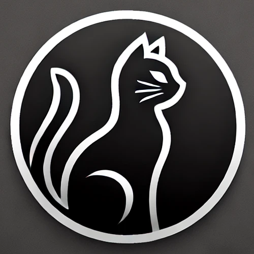

# Bonnie Framework

Bonnie is a lightweight and simple web framework for Python, designed to help build web applications with a focus on flexibility, ease of integration, and extensibility.

## Features

- **Dynamic HTML Components**: Use classes to represent HTML components, allowing you to easily replace tags in HTML code with dynamic content.
- **HTTP Request Handling**: Complete HTTP request handling via a `HTTPRequestHandler` class, supporting standard HTTP methods like GET, POST, PUT, and DELETE.
- **Custom Middleware**: You can add middleware to handle actions before and after request processing, with a default middleware for debugging.
- **Integrated HTTP Server**: The web server is integrated into Bonnie, making it easy to deploy applications without relying on an external server like Apache or Nginx.
- **Flexible HTML Rendering**: You can integrate static HTML files and dynamic components with custom tag handling.
- **HTTP Error Handling**: Provides default error responses for unauthorized methods or pages not found.
